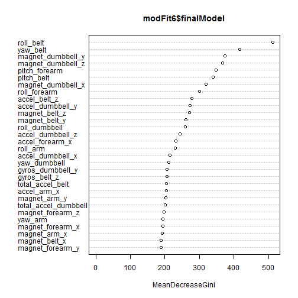
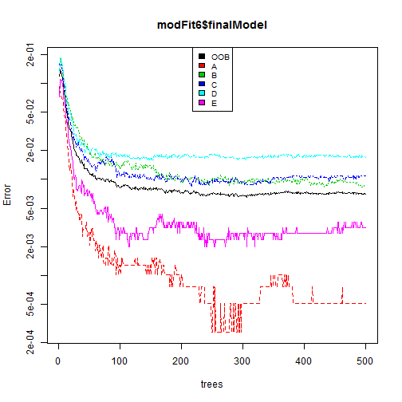

# Study on Predicting Quality of Weightlifting Exercise  
  
  
  
  
    
## SYNOPSIS        
    
  
This is a report on the study of predicting on "how well" a set of 6 participants, in the age group 20-28 years and with limited weightlifting experience, perform the weightlifting exercise using light dumbbells (1.25Kg). There is one "correct" way of doing the exercise (A) and there are 4 (B-E) observable common mistakes as shown below:-  
  
    
A - exactly according to specs  
B - throwing the elbows to the front  
C - lifting the dumbbell only halfway    
D - lowering the dumbbell only halfway  
E - throwing the hips to the front  
  
    
This study is based on the data available from the following HAR study:-  
**Velloso, E.; Bulling, A.; Gellersen, H.; Ugulino, W.; Fuks, H. Qualitative Activity Recognition of Weight Lifting Exercises. Proceedings of 4th International Conference in Cooperation with SIGCHI (Augmented Human '13) . Stuttgart, Germany: ACM SIGCHI, 2013.**  
  
    
Goal of the study is to fit a prediction model which can, based on the data collected from accelerometers (placed on belt, forearm, arm and dumbbell of the 6 participants), help predict *how well they do* the weightlifting exercise.  
  
    
We first collected the data which had around 160 variables. From this raw data we zoomed into 53 covariates and sliced the training data into training and validation data. Then we built a model based on Random Forest algorithm using K-fold cross validation and arrived at the best model and used it to predict the outcome of the test data for the 20 test cases.  

    

```r
library(caret)
```

```
## Loading required package: lattice
## Loading required package: ggplot2
```

  
  
## DATA COLLECTION   


Let us load the data first.  
  
  

```r
url_train <- "https://d396qusza40orc.cloudfront.net/predmachlearn/pml-training.csv"
url_test <- "https://d396qusza40orc.cloudfront.net/predmachlearn/pml-testing.csv"
download.file(url_train, "pml-training.csv")
download.file(url_test, "pml-testing.csv")  
```
  

```r
trainingData <- read.csv("pml-training.csv",na.strings=c("NA","","#DIV/0!"),header=TRUE)
testingData <- read.csv("pml-testing.csv",na.strings=c("NA","","#DIV/0!"),header=TRUE)
```
  
As there are many variables in these 2 sets - let us assure the variables are in proper order. The last variable in training data is *classe* (our output of interest) while in testing data it is the *problem_id* (1 to 20). Check that the other variables are in order:-  
  

```r
nCols <- ncol(trainingData) - 1
trainingCols <- colnames(trainingData)[1:nCols]
testingCols <- colnames(testingData)[1:nCols]
all.equal(trainingCols,testingCols)
```

```
## [1] TRUE
```
  
    
## COVARIATE CREATION    
  
    
Further study of the data shows that large number of NA values exist. Also, there are large number of variables having NA values in all observations. Let us remove those variables first - surely their contribution to model building is nil.  
  
  

```r
NAcols <- apply(trainingData,2,function(x) {sum(is.na(x))}) 
trainingData <- trainingData[,which(NAcols == 0)]
NAcols <- apply(testingData,2,function(x) {sum(is.na(x))}) 
testingData <- testingData[,which(NAcols == 0)]
```
  
    
Now the variables count is *60* only.  
Of these, the first set of 7 variables are more like admin variables - not contributing to model building in any way. Let us remove them too.  
  
    

```r
trainingData <- trainingData[,8:length(colnames(trainingData))]
testingData <- testingData[,8:length(colnames(testingData))]
```
  
    
Now the variables count is *53* only.  
  
    
See whether there are any variables which have near zero variance across these observations. If so, we can remove them as they do not contribute to build our prediction model.  
  
    

```r
nearZeroVars <- nearZeroVar(trainingData,saveMetrics=TRUE)
nearZeroVars
```

```
##                      freqRatio percentUnique zeroVar   nzv
## roll_belt                1.102       6.77811   FALSE FALSE
## pitch_belt               1.036       9.37723   FALSE FALSE
## yaw_belt                 1.058       9.97350   FALSE FALSE
## total_accel_belt         1.063       0.14779   FALSE FALSE
## gyros_belt_x             1.059       0.71348   FALSE FALSE
## gyros_belt_y             1.144       0.35165   FALSE FALSE
## gyros_belt_z             1.066       0.86128   FALSE FALSE
## accel_belt_x             1.055       0.83580   FALSE FALSE
## accel_belt_y             1.114       0.72877   FALSE FALSE
## accel_belt_z             1.079       1.52380   FALSE FALSE
## magnet_belt_x            1.090       1.66650   FALSE FALSE
## magnet_belt_y            1.100       1.51870   FALSE FALSE
## magnet_belt_z            1.006       2.32902   FALSE FALSE
## roll_arm                52.338      13.52563   FALSE FALSE
## pitch_arm               87.256      15.73234   FALSE FALSE
## yaw_arm                 33.029      14.65702   FALSE FALSE
## total_accel_arm          1.025       0.33636   FALSE FALSE
## gyros_arm_x              1.016       3.27693   FALSE FALSE
## gyros_arm_y              1.454       1.91622   FALSE FALSE
## gyros_arm_z              1.111       1.26389   FALSE FALSE
## accel_arm_x              1.017       3.95984   FALSE FALSE
## accel_arm_y              1.140       2.73672   FALSE FALSE
## accel_arm_z              1.128       4.03629   FALSE FALSE
## magnet_arm_x             1.000       6.82397   FALSE FALSE
## magnet_arm_y             1.057       4.44399   FALSE FALSE
## magnet_arm_z             1.036       6.44685   FALSE FALSE
## roll_dumbbell            1.022      83.78351   FALSE FALSE
## pitch_dumbbell           2.277      81.22516   FALSE FALSE
## yaw_dumbbell             1.132      83.14137   FALSE FALSE
## total_accel_dumbbell     1.073       0.21914   FALSE FALSE
## gyros_dumbbell_x         1.003       1.22821   FALSE FALSE
## gyros_dumbbell_y         1.265       1.41678   FALSE FALSE
## gyros_dumbbell_z         1.060       1.04984   FALSE FALSE
## accel_dumbbell_x         1.018       2.16594   FALSE FALSE
## accel_dumbbell_y         1.053       2.37489   FALSE FALSE
## accel_dumbbell_z         1.133       2.08949   FALSE FALSE
## magnet_dumbbell_x        1.098       5.74865   FALSE FALSE
## magnet_dumbbell_y        1.198       4.30129   FALSE FALSE
## magnet_dumbbell_z        1.021       3.44511   FALSE FALSE
## roll_forearm            11.589      11.08959   FALSE FALSE
## pitch_forearm           65.983      14.85577   FALSE FALSE
## yaw_forearm             15.323      10.14677   FALSE FALSE
## total_accel_forearm      1.129       0.35674   FALSE FALSE
## gyros_forearm_x          1.059       1.51870   FALSE FALSE
## gyros_forearm_y          1.037       3.77637   FALSE FALSE
## gyros_forearm_z          1.123       1.56457   FALSE FALSE
## accel_forearm_x          1.126       4.04648   FALSE FALSE
## accel_forearm_y          1.059       5.11161   FALSE FALSE
## accel_forearm_z          1.006       2.95587   FALSE FALSE
## magnet_forearm_x         1.012       7.76679   FALSE FALSE
## magnet_forearm_y         1.247       9.54031   FALSE FALSE
## magnet_forearm_z         1.000       8.57711   FALSE FALSE
## classe                   1.470       0.02548   FALSE FALSE
```
  
    
From the above list we see that none of the remaining variables has near zero variance. So this above set of *53* features form our final list for model building for prediction algorithm  
  
    
## TRAIN AND PREDICT  
  
    
We will decide on the algorithm to be **Random Tree** upfront as it is among the more accurate ones as compared to Classification Tree (rpart). We will tweak a couple of model parameters along with cross validation & basic preprocessing to arrive at a best model  
  
  
The preprocessing will be the same - **c("center","scale")** - for all the models  
For train control parameters the resampling method we will use will be - **"cv" the k-fold cross validation** approach. We'll keep changing the value of k.  
  
    
### setup data for training & validation  
  
  
Let us split the training data, keeping 30% for validation  
  

```r
set.seed(100)
inTrain = createDataPartition(trainingData$classe, p = .7, list=FALSE)
tData = trainingData[inTrain,]
vData = trainingData[-inTrain,]
```
  
    
### train model with k = 5  


```r
set.seed(110)
modFit5 <- train(classe ~., method="rf", data=tData, 
                preProcess=c("center", "scale"), 
                trControl=trainControl(method='cv', number=5, allowParallel=TRUE )
                )
```

```
## Loading required package: randomForest
## randomForest 4.6-10
## Type rfNews() to see new features/changes/bug fixes.
```
  
    
Let us display the features of this model  
  
    

```r
modFit5$finalModel
```

```
## 
## Call:
##  randomForest(x = x, y = y, mtry = param$mtry) 
##                Type of random forest: classification
##                      Number of trees: 500
## No. of variables tried at each split: 2
## 
##         OOB estimate of  error rate: 0.74%
## Confusion matrix:
##      A    B    C    D    E class.error
## A 3905    1    0    0    0    0.000256
## B   18 2630   10    0    0    0.010534
## C    0   25 2369    2    0    0.011269
## D    0    0   37 2213    2    0.017318
## E    0    0    2    5 2518    0.002772
```

```r
vPred <- predict(modFit5, vData)
confusionMatrix(vPred, vData$classe)
```

```
## Confusion Matrix and Statistics
## 
##           Reference
## Prediction    A    B    C    D    E
##          A 1673    8    0    0    0
##          B    1 1130    4    0    0
##          C    0    1 1020   18    0
##          D    0    0    2  945    1
##          E    0    0    0    1 1081
## 
## Overall Statistics
##                                         
##                Accuracy : 0.994         
##                  95% CI : (0.992, 0.996)
##     No Information Rate : 0.284         
##     P-Value [Acc > NIR] : <2e-16        
##                                         
##                   Kappa : 0.992         
##  Mcnemar's Test P-Value : NA            
## 
## Statistics by Class:
## 
##                      Class: A Class: B Class: C Class: D Class: E
## Sensitivity             0.999    0.992    0.994    0.980    0.999
## Specificity             0.998    0.999    0.996    0.999    1.000
## Pos Pred Value          0.995    0.996    0.982    0.997    0.999
## Neg Pred Value          1.000    0.998    0.999    0.996    1.000
## Prevalence              0.284    0.194    0.174    0.164    0.184
## Detection Rate          0.284    0.192    0.173    0.161    0.184
## Detection Prevalence    0.286    0.193    0.177    0.161    0.184
## Balanced Accuracy       0.999    0.996    0.995    0.990    0.999
```
  
    
As displayed above, for this model, the **OOB estimate of error rate is 0.74%** and the **prediction accuracy is 0.9939**  
  
    


    
### train model with k = 6  


```r
set.seed(110)
modFit6 <- train(classe ~., method="rf", data=tData, 
                preProcess=c("center", "scale"), 
                trControl=trainControl(method='cv', number=6, allowParallel=TRUE )
                )
```
  
      
      

```r
modFit6$finalModel
```

```
## 
## Call:
##  randomForest(x = x, y = y, mtry = param$mtry) 
##                Type of random forest: classification
##                      Number of trees: 500
## No. of variables tried at each split: 2
## 
##         OOB estimate of  error rate: 0.71%
## Confusion matrix:
##      A    B    C    D    E class.error
## A 3904    2    0    0    0    0.000512
## B   11 2635   11    1    0    0.008653
## C    0   24 2370    2    0    0.010851
## D    0    0   35 2214    3    0.016874
## E    0    1    3    4 2517    0.003168
```

```r
vPred <- predict(modFit6, vData)
confusionMatrix(vPred, vData$classe)
```

```
## Confusion Matrix and Statistics
## 
##           Reference
## Prediction    A    B    C    D    E
##          A 1673    8    0    0    0
##          B    1 1130    5    0    0
##          C    0    1 1019   16    0
##          D    0    0    2  947    1
##          E    0    0    0    1 1081
## 
## Overall Statistics
##                                         
##                Accuracy : 0.994         
##                  95% CI : (0.992, 0.996)
##     No Information Rate : 0.284         
##     P-Value [Acc > NIR] : <2e-16        
##                                         
##                   Kappa : 0.992         
##  Mcnemar's Test P-Value : NA            
## 
## Statistics by Class:
## 
##                      Class: A Class: B Class: C Class: D Class: E
## Sensitivity             0.999    0.992    0.993    0.982    0.999
## Specificity             0.998    0.999    0.997    0.999    1.000
## Pos Pred Value          0.995    0.995    0.984    0.997    0.999
## Neg Pred Value          1.000    0.998    0.999    0.997    1.000
## Prevalence              0.284    0.194    0.174    0.164    0.184
## Detection Rate          0.284    0.192    0.173    0.161    0.184
## Detection Prevalence    0.286    0.193    0.176    0.161    0.184
## Balanced Accuracy       0.999    0.995    0.995    0.991    0.999
```
  
    
As displayed above, for this model, the **OOB estimate of error rate is 0.71%** and the **prediction accuracy is 0.9941**  
  
    
  
    
### train model with k = 7  


```r
set.seed(110)
modFit7 <- train(classe ~., method="rf", data=tData, 
                preProcess=c("center", "scale"), 
                trControl=trainControl(method='cv', number=7, allowParallel=TRUE )
                )
```
  
    
  
      
      

```r
modFit7$finalModel
```

```
## 
## Call:
##  randomForest(x = x, y = y, mtry = param$mtry) 
##                Type of random forest: classification
##                      Number of trees: 500
## No. of variables tried at each split: 27
## 
##         OOB estimate of  error rate: 0.79%
## Confusion matrix:
##      A    B    C    D    E class.error
## A 3900    3    1    0    2    0.001536
## B   19 2630    8    1    0    0.010534
## C    0   17 2371    8    0    0.010434
## D    0    2   27 2220    3    0.014210
## E    0    2    7    8 2508    0.006733
```

```r
vPred <- predict(modFit7, vData)
confusionMatrix(vPred, vData$classe)
```

```
## Confusion Matrix and Statistics
## 
##           Reference
## Prediction    A    B    C    D    E
##          A 1672    8    0    0    0
##          B    2 1128    2    0    1
##          C    0    3 1020   13    3
##          D    0    0    4  951    2
##          E    0    0    0    0 1076
## 
## Overall Statistics
##                                         
##                Accuracy : 0.994         
##                  95% CI : (0.991, 0.995)
##     No Information Rate : 0.284         
##     P-Value [Acc > NIR] : <2e-16        
##                                         
##                   Kappa : 0.992         
##  Mcnemar's Test P-Value : NA            
## 
## Statistics by Class:
## 
##                      Class: A Class: B Class: C Class: D Class: E
## Sensitivity             0.999    0.990    0.994    0.987    0.994
## Specificity             0.998    0.999    0.996    0.999    1.000
## Pos Pred Value          0.995    0.996    0.982    0.994    1.000
## Neg Pred Value          1.000    0.998    0.999    0.997    0.999
## Prevalence              0.284    0.194    0.174    0.164    0.184
## Detection Rate          0.284    0.192    0.173    0.162    0.183
## Detection Prevalence    0.285    0.193    0.177    0.163    0.183
## Balanced Accuracy       0.998    0.995    0.995    0.993    0.997
```
  
    
As displayed above, for this model, the **OOB estimate of error rate is 0.79%** and the **prediction accuracy is 0.9935**  
  
    
### Best model  

From the characteristics displayed we notice that the **model with k = 6** has the **minimum value for OOB estimate of error rate = 0.71%** and a **maximum value for overall accuracy = 0.9941**. Therefore we choose this as our best model.  
  
Further characteristics of our chosen model are shown below:-  
  
    

```r
varImpPlot(modFit6$finalModel)
```

 
  
   
The above figure depicts the top few features of importance in our best model  
    

```r
plot(modFit6$finalModel,log="y")
legend("top", colnames(modFit6$finalModel$err.rate),col=1:6,cex=0.8,fill=1:6)
```

 
  
    
The above figure plots the error in estimating for the best model.  
  
    
  
    
## RESULTS  
  
    
Using our best model, *modFit6*, which is based on K = 6 folds, the prediction on the 20 testcases is as shown below:-  
  
    

```r
testingDataPred <- predict(modFit6,testingData)
testingDataPred
```

```
##  [1] B A B A A E D B A A B C B A E E A B B B
## Levels: A B C D E
```

  
    
    
   

    
  
    
  
    

    
    
